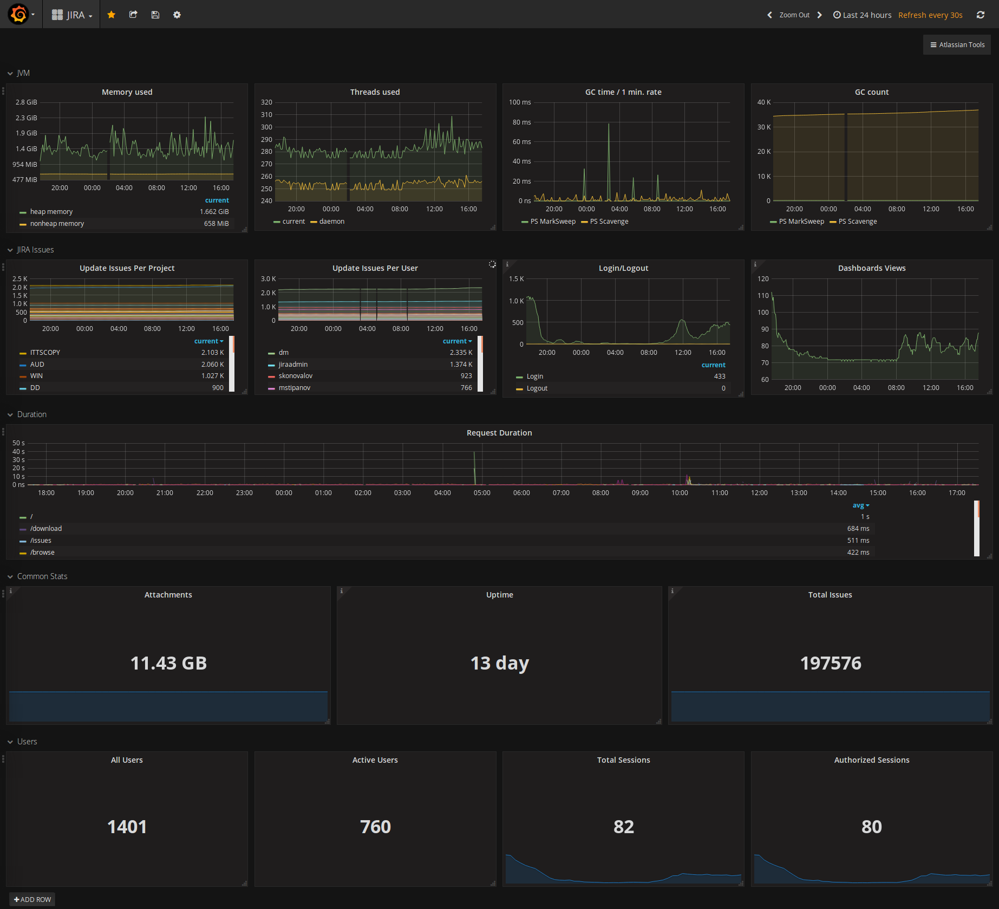

# Prometheus Exporter For Jira 

This is a Jira plugin which provides an endpoint to expose Jira metrics to Prometheus.

For more information the documentation [Prometheus Exporter For Jira](https://github.com/AndreyVMarkelov/jira-prometheus-exporter/wiki/Prometheus-Exporter-For-JIRA).

On Atlassian Marketplace [Prometheus Exporter For Jira](https://marketplace.atlassian.com/plugins/ru.andreymarkelov.atlas.plugins.prom-jira-exporter/server/overview)

## Grafana 

* [Example Grafana Dashboard](https://grafana.com/dashboards/5249)

